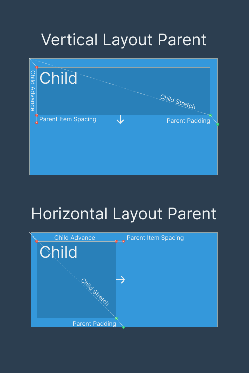
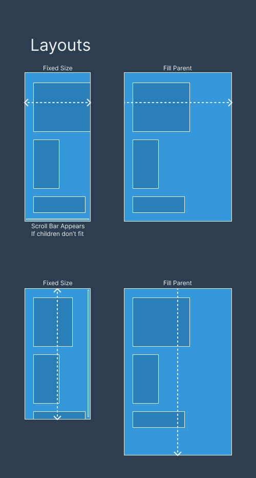
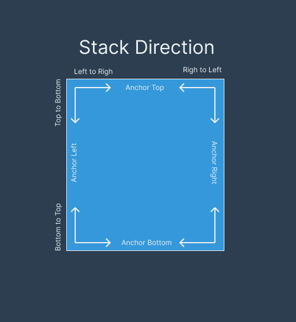

# Layout in Silky

Layout in Silky is a little different because it uses an immediate mode UI. Some layouts just are not possible without custom math since in immediate mode you have to know the position of every widget as you draw it. That is how immediate mode works. This limits what layouts you can do, but it also makes reasoning about them simpler. The layout system is more straightforward and easier to think about because the problem space is smaller and more constrained.

## The pen and stretch pen.

Think about how the layout works. Imagine a "pen" that decides where the next widget goes. You create a parent element, and it has padding. Because of that padding, the pen moves inward. Then you add a child element. The child moves the pen depending on whether the parent layout is vertical or horizontal. In a vertical layout, the pen advances by the child's height. In a horizontal layout, it advances by the child's width.

After moving the pen, you also need to account for parent item spacing, which is how much space sits between children. This spacing depends on whether the layout is vertical or horizontal and must be applied accordingly.

There is also a second conceptual pen, the "stretch pen." When you place a child layout inside a parent, it stretches the parent's size. Both the width and height may grow depending on the child's dimensions. At the end, when the parent box is closed and drawn, the parent padding is added again to this accumulated stretch size.

## Stretch and sizing layouts.

Stretch to fit layouts that require knowing the sizes of all children in advance are tricky in immediate mode UIs. Withoug scrafacing perf of frame independence, you cannot look ahead to compute total child sizes before drawing them. Layouts that depend on precomputed child measurements simply do not work here.

What *is* possible:

* **Fixed size layouts**, because all sizes are known ahead of time.
* **Fill parent layouts**, because the parent's size is already known and children can expand to match it.

When children stretch a parent, they expand its **inner dimensions**. If the inner dimensions exceed the parent's outer dimensions, a scrollbar appears. Scrollbars can be enabled or disabled depending on your needs.

Stretching can happen independently in the X and Y directions. For example:

* Fixed size in X and fill parent in Y
* Fill parent in X and fixed size in Y
* Or any combination of the two

## Stacking direction and anchoring.

Next is the **stacking direction**, which is very flexible. Stacking direction is handled by reversing signs in the layout math. The underlying logic stays the same.

There is also the concept of **anchoring**, which determines where stacking begins. You can anchor at a side and stack:

* Anchor to Top
    * Stack Left to right
    * Stack Right to left
* Anchor to Bottom
    * Stack Left to right
    * Stack Right to left
* Anchor to Left
    * Stack Top to bottom
    * Stack Bottom to top
* Anchor to Right
    * Stack Top to bottom
    * Stack Bottom to top

Most UIs anchor on the left and stack from top to bottom. That is the default and most common layout style. But you could build something like a chat application that anchors at the bottom and stacks upward, since new chat bubbles appear there. You can also create panels that stack controls inward from different edges to organize screen layout.

## Performance considerations.

The layouts are constrained not because they are hard to build, but because of performance. In theory, we could precompute child layouts, throw away the actual widgets, and keep only their sizes. But that would add extra computation. This goes against the core philosophy of Silky, which prioritizes maximum performance.

Yes, we could add precomputation and make the layout system more flexible, but we chose not to on purpose. The goal is to keep the UI as fast as possible. The "holy grail" of immediate mode UI is speed: no extra bookkeeping, no unnecessary memory storage, no redundant calculations.

In immediate mode, drawing the UI is almost like using print statements. You emit the widgets, they get rendered for that frame, and then they are gone. There is no retained tree structure or persistent layout state. This simplicity is what makes immediate mode UIs so fast.

That is the main reason the layouts are constrained: not because of technical limitations, but because of a deliberate design choice in favor of performance.

You might say, "I want this layout or that layout, I want to do this and that." In practice, you usually can.

In Silky, everything supports explicit X, Y, and position settings. That means you can use your own math formulas, often much simpler than trying to solve a generalized layout puzzle, to compute exactly where things should go based on what you know about your UI and your data.

For example, you often know how many elements are in a list, and you can figure out their height from the data. With a little upfront math and some simple heuristics, you can compute the sizes and positions of even fairly complex layouts without building an elaborate layout system or doing extra passes.

Then, when it is time to draw, you just plug in the computed numbers for X, Y, width, and height.

In my experience, this works better than a complicated layout system. The code makes it obvious where everything goes, and it is usually much faster.

I feel that explicit math formulas work better because they clearly express intent. In more complicated layout systems, the final layout can feel accidental, as if many separate pieces of code happen to combine and produce the result. It can seem like the layout emerges from a web of interactions rather than from a clear, deliberate decision.

With the formula based approach, you write exactly what you want. You understand your data, you compute the layout directly, and then you apply it. The result is much more intentional. The positioning logic is explicit, readable, and grounded in the actual structure of your UI rather than being the byproduct of a complex layout engine.
